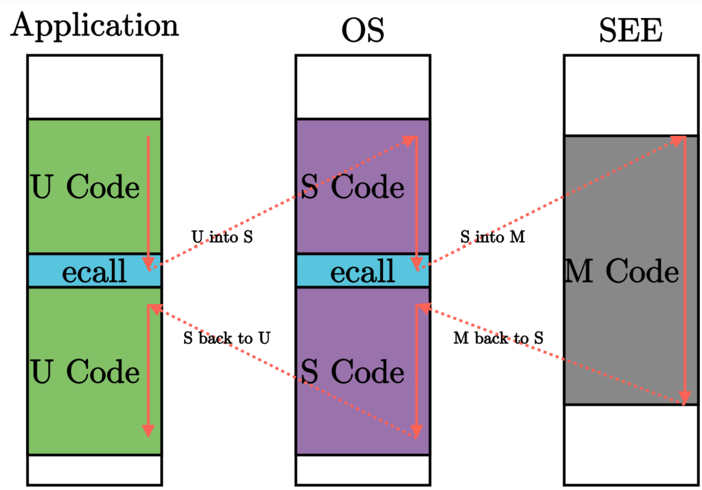

# 批处理系统
目标：保障系统安全，多应用支持。__批处理系统__：将多个程序打包输入计算机，当一个程序运行结束后，计算机自动加载下个程序到内存并执行。__特权级__：应用程序难免出错，为避免影响其他应用程序，需要OS终止出错程序。特权级让应用程序运行在用户态，操作系统运行在内核态，实现用户态和内核态隔离。  
## 特权级机制
特权级的软硬件协同设计。RISCV定义4中特权级：0为用户User，1为监督Supevisor，2为虚拟监督Hypervisor, 3为机器。  
执行环境调用`ecall`，是一种陷入类指令，包括M模式和S模式的SBI，S模式和U模式之间的ABI，又称系统调用。陷入式异常控制流会切换CPU特权级。  
  
## RISCV特权指令
每个特权级对应特殊指令和控制状态寄存器(CSR)。两类S模式特权指令：
1. 指令本身属于高特权级指令，sret表示从S模式返回U模式
2. 指令访问了S模式下才能访问的寄存器
## 实现应用程序
